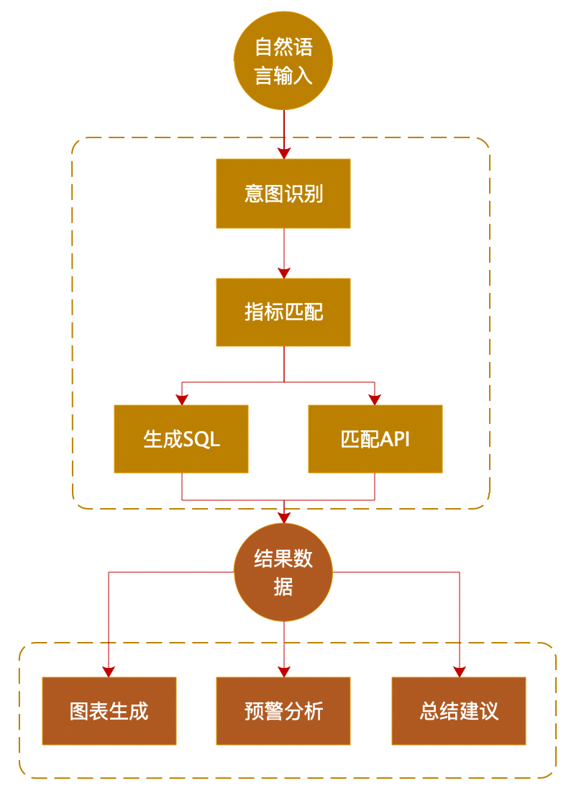

# Langchain-ChatBI 

## 介绍
🌍 [_READ THIS IN ENGLISH_](README_en.md)

🤖️ 一种利用 [ChatGLM-6B](https://github.com/THUDM/ChatGLM-6B) + [langchain](https://github.com/hwchase17/langchain) 实现的基于本地知识的对话式BI，
同时支持百川和通义千问大模型。

## 解决的痛点
  该项目是一个可以实现完全本地化， 重点解决数据安全保护，数据权限管理，私域化部署的企业痛点。 本开源方案采用Apache License，可以免费商用，无需付费。
  本项目利用指标匹配，解决对话式BI如何确保数据准确的难点。

## 快速上手

### 1. 环境配置

+ 首先，确保你的机器安装了 Python 3.8 - 3.11
```
$ python3 --version
Python 3.10.0
```
 接着，创建一个虚拟环境，并在虚拟环境内安装项目的依赖
```shell
# 拉取仓库
$ git clone https://github.com/dynamiclu/Langchain-ChatBI.git

# 进入目录
$ cd Langchain-ChatBI

# 安装全部依赖
$ pip3 install -r requirements.txt 
```