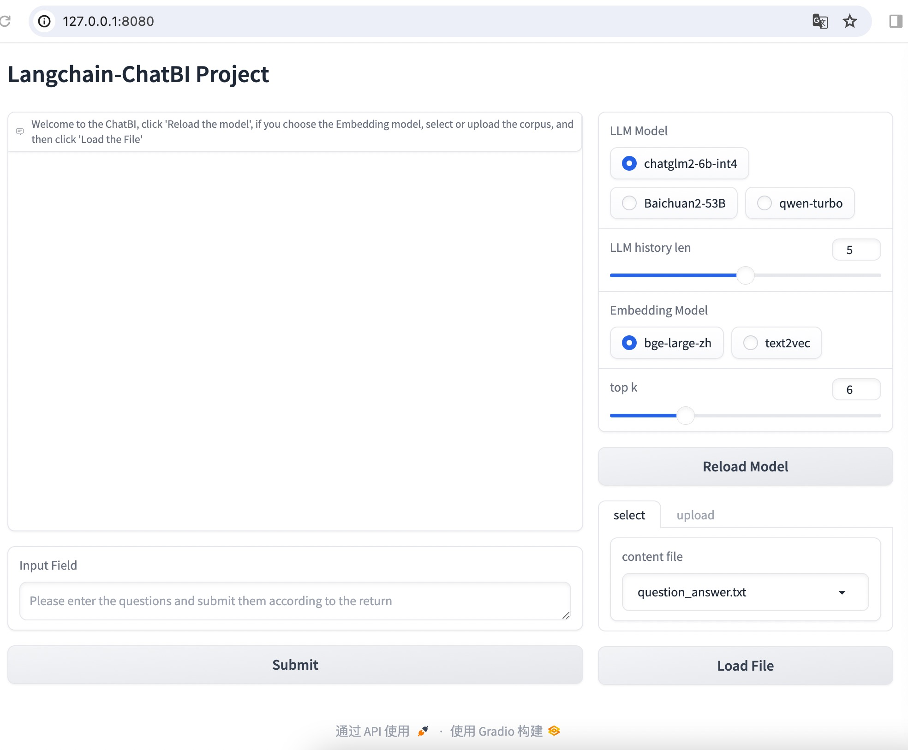

# Langchain-ChatBI 

## 介绍
[_READ THIS IN ENGLISH_](README_en.md)

一种利用 [Langchain](https://github.com/hwchase17/langchain) 框架实现的基于本地物料的对话式BI。

该项目可以实现本地化部署，可启动本地大模型([ChatGLM-6B](https://github.com/THUDM/ChatGLM-6B) )，也可用HTTP调用百川和通义千问大模型。本项目利用大模型的语言理解能力，识别用户的BI意图，利用指标匹配，解决对话式BI如何确保数据准确的难点。

## 部署

### 1. 环境配置

+ 确保你的机器安装了 Python 3.8 - 3.11
```
$ python3 --version
Python 3.10.0
```

```shell
# 拉取仓库
$ git clone https://github.com/dynamiclu/Langchain-ChatBI.git

# 进入目录
$ cd Langchain-ChatBI

# 安装全部依赖
$ pip3 install -r requirements.txt 
```
### 2. 模型下载
   + 向量模型
    
```python
# bge-large-en-v1.5 下载
from modelscope import snapshot_download
model_dir = snapshot_download('AI-ModelScope/bge-large-en-v1.5')

#text2vec 下载
from modelscope import snapshot_download
model_dir = snapshot_download('Jerry0/text2vec-large-chinese')
```
+ 大模型
```python
#chatglm2-6b-int4 下载
from modelscope import snapshot_download
model_dir = snapshot_download('ZhipuAI/chatglm2-6b-int4')
```

### 3. 启动Gradio
```shell
# 启动Gradio
$ python3 main_webui.py
```
### 4. 示例
