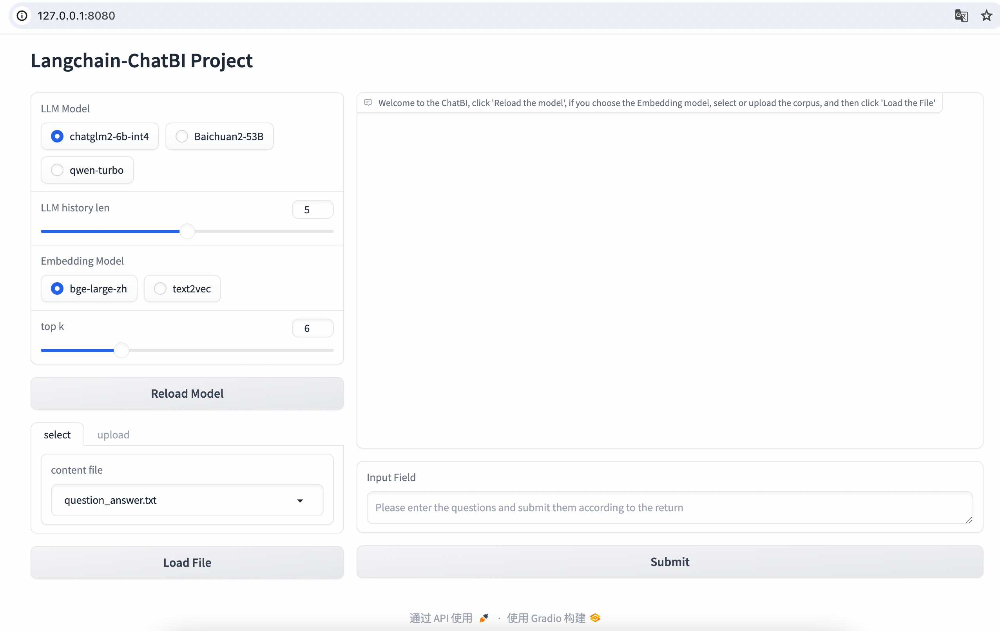

# Langchain-ChatBI 

A conversational BI implemented using the Langchain framework and local vector library aims to help users find and understand data knowledge, analyze data, and gain insights into results. Through natural language dialogue, the threshold for data analysis is lowered.


## Deploy

### 1. Environmental configuration

+ Ensure that your machine has Python 3.8-3.11 installed in the environment configuration
```
$ python3 --version
Python 3.10.0
```

```shell

$ git clone https://github.com/dynamiclu/Langchain-ChatBI.git

$ cd Langchain-ChatBI

$ pip3 install -r requirements.txt 
```
### 2. Model Download
   + Vector model
    
```python
# bge-large-en-v1.5 
from modelscope import snapshot_download
model_dir = snapshot_download('AI-ModelScope/bge-large-en-v1.5')

#text2vec 
from modelscope import snapshot_download
model_dir = snapshot_download('Jerry0/text2vec-large-chinese')
```
+ LLM
```python
from modelscope import snapshot_download
model_dir = snapshot_download('ZhipuAI/chatglm2-6b-int4')
```

### 3. Start Gradio
```shell
# 启动Gradio
$ python3 main_webui.py
```
### 4. Example
